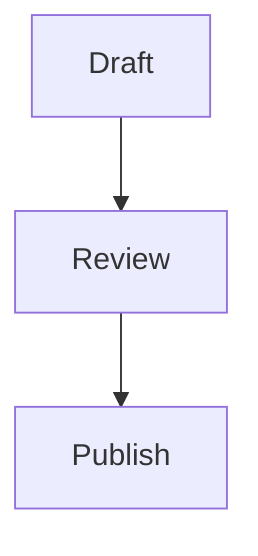

# Draftmark Markdown Sample

Draftmark turns plain text into a clean document. Use **Markdown** to add structure while you write.

## Headings and paragraphs

Use number signs to create headings. Leave a blank line between paragraphs.

### A smaller heading

This is a second paragraph. It contains *italic text*, **bold text**, and ***strong emphasis***.

## Line breaks

Use an HTML break when two lines must stay together.<br>
This is the next line in the same paragraph.

## Blockquotes

> A short note can highlight an important idea.
>
> > A nested note can add more detail.

## Lists

Plan a writing session:

1. Open a Markdown file.
2. Write the first draft.
3. Review the live preview.

Useful Draftmark features:

- Split editor and preview
- Local file access
  - Open existing documents
  - Save new documents
- GFM table support

## Code

Use `Cmd-S` to save a document. Fenced blocks can show source code:

```swift
let title = "A focused writing space"
print(title)
```

## Diagram

Draftmark also previews Mermaid diagrams in fenced code blocks:



## Table

| Format | Best for | Status |
| --- | --- | --- |
| Markdown | Notes and documents | Ready |
| GFM | Tables and extended syntax | Ready |
| HTML | Custom preview content | Supported |

## Links

Visit the [Draftmark repository](https://github.com/vjanelle/Draftmark "Draftmark source code") for project information.

You can also write a direct URL: <https://www.markdownguide.org/>.

Reference-style links keep long URLs out of the paragraph. See the [Markdown Guide][guide] for more syntax.

## Other formatting

~~This text is no longer current.~~

Use a backslash to show a literal character: \*not italic\*.

---

Draftmark keeps your documents local and your writing focused.

[guide]: https://www.markdownguide.org/basic-syntax/ "Basic Markdown syntax"
