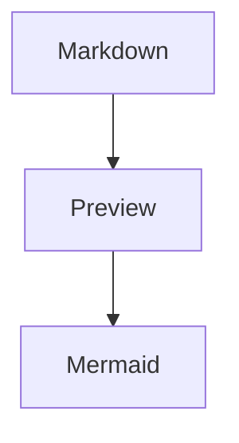
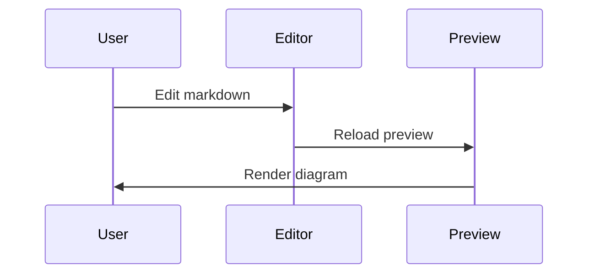

GitHub Flavored Markdown Sample

Original sample by Satoshi Iwaki from [markdown-editor-mac-objc](https://github.com/satoshi-iwaki/markdown-editor-mac-objc).

## Table

| Column 1   | Column 2 | Column 3     | Column 4 |
| ---------- | :------: | ------------ | -------: |
| 2018-01-01 | Alpha    | Example text |      123 |
| 2018-01-02 | Bravo    | More text    |      456 |

## Strikethrough
~~Strikethrough~~

## Emphasis
*Italic*

_Italic_

**Bold**

__Bold__

***Bold + Italic***

___Bold + Italic___

## Emoji
:smile:
:laughing:
:blush:
:relaxed:

[Emoji cheat sheet](http://www.emoji-cheat-sheet.com/)

## Link
[GitHub Flavored Markdown](https://guides.github.com/features/mastering-markdown/)

## Quote

> First line
> Second line
> Third line


---
# Heading 1
Body text

## Heading 2
Body text

### Heading 3
Body text

#### Heading 4
Body text

##### Heading 5
Body text

###### Heading 6
Body text

---

## Unordered List
- Unordered item 1
- Unordered item 2


* Unordered item 1
* Unordered item 2

## Ordered List
1. Ordered item 1
1. Ordered item 1-1
1. Ordered item 1-2
1. Ordered item 2
1. Ordered item 2-1
1. Ordered item 2-2

## Syntax Highlighting

```javascript
function fancyAlert(arg) {
if(arg) {
$.facebox({div:'#foo'})
}
}
```

## Mermaid




